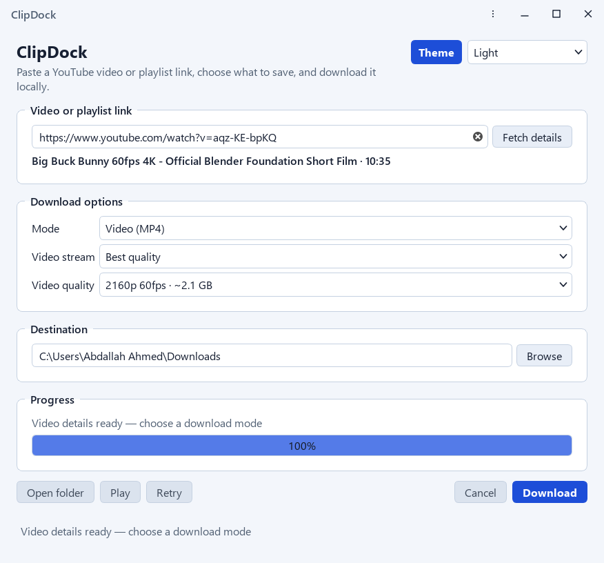
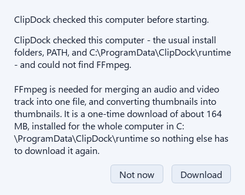
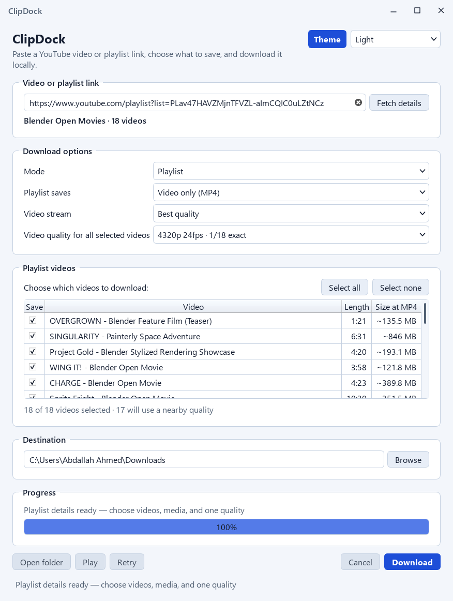
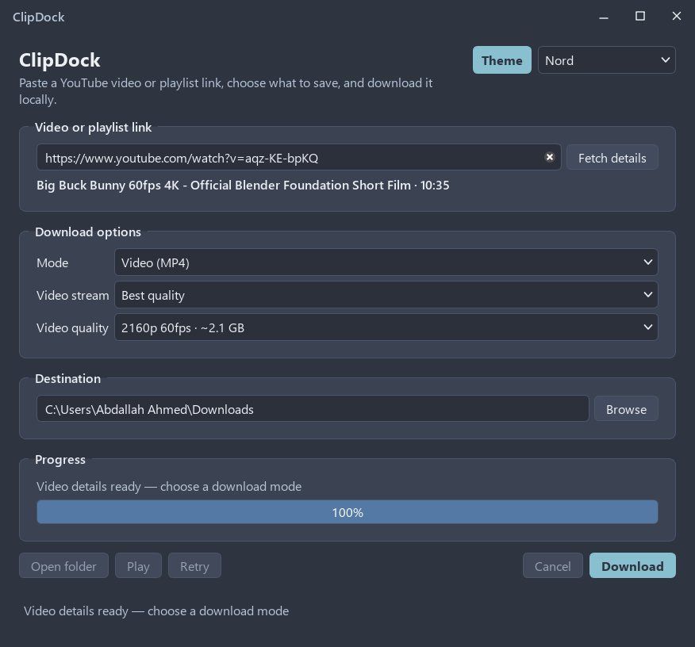

# ClipDock

A Windows 10/11 desktop application for downloading publicly accessible YouTube videos as MP4, MP3, or their largest available thumbnails, and for saving their captions as `.srt` or `.vtt` files. It also provides two multi-link workflows: an explicit, opt-in playlist workflow that can save selected playlist videos, and a batch queue for pasting any number of unrelated links. It uses Python, PySide6, yt-dlp, and FFmpeg.

The application is named **ClipDock** after the "dock" its downloads land in. Its icon is a **download arrowhead with a smaller one nested inside it** - the same glyph twice, at two scales - in white on a flat graphite tile, because a lone downward triangle is the most borrowed shape in the category and a saturated gradient tile is the loudest signal that an icon belongs to the downloader-crack genre. It appears in the taskbar, in Alt+Tab, and on the executable itself. The icon is generated by `tools\make_icon.py`; see [The icon](#the-icon) for what it is checked against.



<sub>The actual window with a real video's details fetched, not a mock-up, so it cannot drift away from the program the way a drawing would. Regenerate it with `.\.venv\Scripts\python.exe tools\make_screenshot.py`; the script refuses to write an image of an empty window, of an unreadable font, or of a window with part of it scrolled out of view. The other pictures in this README come from the same command with `--view playlist`, `--view first-run`, and `--theme Nord`.</sub>

## Install

Download **`ClipDock-Setup.exe`** from the [Releases](https://github.com/Abdalllah10Ahmed/ClipDock/releases) page and run it. Next, Next, choose a folder, done. It installs for your user account only, so it never asks for administrator rights.

Two things to expect on a machine that has not run ClipDock before:

- **An unsigned-binary warning.** The installer is not code-signed, so Windows SmartScreen may show "Windows protected your PC". Click **More info**, then **Run anyway**. This is the cost of not buying a signing certificate, and it is the only thing about the install that should surprise anyone. The installer's first page says the same thing before anything is written to disk.
- **A first-run FFmpeg question.** ClipDock looks for FFmpeg anywhere on the machine first, and only asks to download it if it genuinely cannot find one. It is the only thing ever downloaded. Answering no is fine — the program opens anyway and every other feature still works; only video merging, MP3 conversion, and cover-art embedding need it.

<p align="center">
  
</p>

<p align="center"><sub>What a first launch looks like on a computer with no FFmpeg. It asks before spending anything, names the size and the destination folder up front, and <b>Not now</b> is a real answer rather than a dismissal — the window opens anyway. The wording, the download size, the install folder and the free-space check in that picture are all live; the one thing staged is the device search being told it found nothing, so the dialog has something to offer. Reproduce it with <code>.\.venv\Scripts\python.exe tools\make_screenshot.py --view first-run</code>.</sub></p>

Nothing else is needed. Python, PySide6, and yt-dlp are all inside the installer. To check the file you downloaded, compare its SHA-256 with the one published alongside it on the Releases page.

<details>
<summary>Building it yourself from source</summary>

See [Setup and run](#setup-and-run) for running from source and [Build the installer](#build-the-installer) for producing `ClipDock-Setup.exe` yourself. You will need Inno Setup 6 for the installer; `scripts\build_installer.ps1` tells you if it is missing.

</details>

## Supported workflow

1. Paste a YouTube video URL (`youtube.com/watch`, `youtu.be`, Shorts, embeds, and live-video URLs are supported), or select **Playlist** and paste a `youtube.com/playlist?list=...` URL, or select **Batch queue** and paste as many links as you like on separate lines.
2. Select **Fetch details** for the single-video and playlist modes. The batch queue reads each of its own links, so it needs no fetch step.
3. Choose **Video (MP4)**, **Audio (MP3)**, **Thumbnail**, **Subtitles**, **Playlist**, or **Batch queue**. Single-video downloads remain the default; collection links are accepted only in playlist mode.
4. For video, select a resolution/frame-rate option. Every option in that list carries its own estimated file size beside the resolution, so the cost of each choice is visible without selecting it. For audio, select 128, 192, 256, or 320 kbps; those entries are costed from the bitrate the same way. The MP3 is written **with the video's own cover art embedded in it**, so players show the artwork instead of a blank icon, and no separate image file is left in the folder. **Embed cover art in MP3** switches that off, and the choice is remembered. The switch only appears when the output is actually an MP3 - in video, thumbnail, and subtitle modes it is hidden, because there would be no MP3 for it to act on. It also appears in playlist mode when the per-video media is set to audio.
5. For subtitles, choose **SubRip (SRT)** or **WebVTT (VTT)**, then choose where the captions come from:
   - **Author-written first** — human captions, falling back to auto-generated ones for a language that has no human track. This is the default and the safest choice.
   - **Auto-generated (ASR)** — only YouTube's speech-recognition captions.
   - **All available tracks** — every advertised track, author-written and automatic.

   Pick a single language from the language list, or leave it on the "all tracks" entry. Each language becomes its own file, named `<title> [<id>].<language>.srt`.
6. For video, optionally choose what to optimise for. **Best quality** takes the largest stream YouTube offers at that resolution. **Smaller file** takes the leanest H.264 MP4 YouTube offers at the same resolution instead, which is often a large saving with no visible quality loss and no re-encoding. Because the size sits in the list itself, changing this re-costs every entry immediately, so you see the saving before committing. See *Stream preference tradeoffs* below.
7. In playlist mode, additionally choose what each video is saved as (**Video only (MP4)**, **Audio only (MP3)**, or **Subtitles**), then tick the videos you want in the **Playlist videos** list. **Select all** and **Select none** set the whole list at once. Every list entry shows that video's own estimated size for the selected quality, plus its length, and a count of the selection appears above the list.
8. In batch queue mode, paste the links into the **Queue links** box, one per line. Duplicates and blank lines are removed and anything that is not a YouTube link is counted and reported. Choose a resolution, and every link picks its own nearest available quality, because links in a batch come from unrelated channels and cannot be assumed to share resolutions.
9. Choose an output folder and press **Download**. Playlist videos and queued links are processed sequentially with one aggregate progress bar; a failed entry is reported and the rest continue.
10. When a download finishes, **Open folder** and **Play** become available, and the **Last saved files** list shows what was written. If a playlist or batch job left anything behind, **Retry** becomes **Retry failed** and its tooltip counts how many items are waiting - "2 videos" or "1 link", never the wrong noun. Pressing it re-runs only those, using the settings currently shown in the window. At rest the button reads a plain **Retry** and is disabled, because there is nothing yet for it to rescue; single-video downloads have no list to retry, so the button stays off in that mode. Playlist retries are matched on the video ids the engine recorded, not on titles, so a playlist containing the same title twice still retries the right video.
11. A running download can be stopped two ways. **Pause** stops the job and keeps everything already downloaded; **Cancel** stops it too, but does not offer to continue afterwards. Pause is **not a true pause** — yt-dlp exposes no pause primitive, so what it really does is stop the download and leave every piece it has written where it is — and whether a continuation then picks up at the byte it reached rather than starting over has **not** been verified against YouTube, so nothing here promises it. **Resume** appears beside **Retry** only when there is genuinely something to continue: a part-written file with real bytes, left by a job *this session* stopped. Its tooltip counts exactly what it will continue ("1 download" or "2 downloads"), it re-runs the job that was paused rather than whatever is on screen now, and it keeps saving to the folder that job started in. It is hidden rather than greyed out when there is nothing to continue, because a Resume that cannot do anything is worse than no Resume at all. Closing the program ends that offer: nothing survives a restart that could rebuild the request for a download whose only remaining trace is a `.part` file with no link in it.
12. Use the upper-right **Theme** selector to pick from 10 palettes, including the high-contrast **Light** and **Dark** (which is the VS Code Dark+ palette) and other popular schemes. **The theme you pick is remembered, so the program always opens on it.** There is nothing to configure and no "set as default" step: choose it once and every later launch starts there.



<sub>Playlist mode, against a real eighteen-video playlist. Every row is costed individually, so a two-hour feature film and a one-minute short are both priced before either is ticked — which is the part a playlist downloader usually leaves you to guess at. Regenerate with `.\.venv\Scripts\python.exe tools\make_screenshot.py --view playlist`.</sub>

The **Theme** control is sized to fit the longest name in its own list and never changes width, at every window size, including maximized and full-screen windows.



<sub>The same window in one of the other palettes — Nord, here. Any of the ten can be applied and remembered; `--theme Nord` on the screenshot command renders this picture.</sub>

The choice is kept in a small `settings.json` in your per-user application folder, beside the log files. It is written when you pick a theme and read once at startup, and it is written through a temporary file so an interrupted save cannot leave a truncated file behind. Everything about it fails soft: a missing, unreadable, or hand-edited file just means the program starts on the default theme instead of refusing to open. A theme id that no longer exists - one removed in a later version - is also treated as unset, so an old saved value can never break startup.

## The window frame

The window draws its own title bar instead of using the native one. The replacement keeps everything the shell would have provided: drag the caption to move the window, double-click it or use the middle button to maximize and restore, and resize from any edge. Edge hit-testing is handed back to Windows, so snap layouts and Aero-style snapping still work. Windows' own border thickness is used for the resize grip, capped so it can never grow taller than the title bar itself.

The window's corners are rounded by the Desktop Window Manager (`DWMWA_WINDOW_CORNER_PREFERENCE`), not by making the window see-through. That distinction matters: DWM clips the window to a rounded shape while the window itself stays fully opaque, so the guarantee below still holds. The DWM border colour is set from the theme as well, so the outline follows the palette instead of being a fixed system grey. On a Windows build without these attributes the calls simply fail and the window keeps its square corners.

The three caption buttons are drawn the way Windows draws its own rather than styled as application buttons. Each one is a flat rectangle with no border, no resting fill, and no rounded corners, 46 pixels wide and the full height of the caption strip, sitting against the top-right corner with no gutter so the close button is at the very edge. The glyph is painted with `QPainter` instead of being a character in the button's font, because a text glyph is laid out against the font's baseline and the three marks ended up at three different heights and three different weights - which is what made them read as typed labels. Hover and press highlight the whole rectangle edge to edge in the palette's neutral button colour, and the close button uses Windows' own `#c42b1c` on hover with a white glyph, because a caption button that changes colour with the application's palette stops being recognisable as the close button. The maximize button's glyph and tooltip both change when the window is maximized, so it never claims to maximize a window that already is. All three stay out of the resize grip.

`gui/caption.py` owns that painting. The rationale is in the module docstring: what makes a window frame legible is that it is unchanged in every application, so anything decorative on the caption is a cost rather than a feature.

Every theme is fully opaque, so the window is an ordinary application window that happens to have its own caption. The app is drawn on a card that reaches the window edges, and `gui/themes.py` refuses to build a palette whose card is translucent, because text is only ever painted on that card. A test renders all ten themes and asserts no rendered pixel anywhere along the window edge has an alpha below 255. The caption strip is above the card rather than inside it, so it carries the card's own colour and paints the top of the window itself; both halves are the same opaque surface and read as one continuous face.

## Lists and scroll bars

The caption sits **outside** the scroll area, as a fixed strip above it. It used to be the first row of the scrolling card, which put the scroll bar the full height of the window right beside the caption buttons and made the caption itself scroll out of sight. A caption is fixed furniture, and the scroll bar belongs to the content it scrolls - it now starts below the caption strip and is only as tall as the content, not as tall as the window.

The scroll bar's handle is a capsule floating inside its groove rather than a block welded to it: a 14-pixel groove with a 4-pixel pill inset 5 pixels on each side and a radius of exactly half the pill, so both ends are genuinely round rather than a rounded rectangle with square top and bottom. It widens to 8 pixels and takes the accent colour on hover. The inset comes from the handle's own margin, which Qt does honour. The handle is drawn in the palette's `muted` colour, which is the contrast step the palette already uses for text that must stay readable; the previous handle colour was `border`, which in most themes sits between the page and the surface - close enough to both that it disappeared. The arrow buttons at each end are removed so the handle runs the full length of the track, and a 40-pixel minimum keeps it a usable grab target on a long list.

The groove is painted in the card's own colour rather than left transparent. This is not cosmetic: the card is narrower than the viewport by exactly the scroll bar's width, so a clear groove would let the desktop show through the window. A scroll bar margin is avoided for the same reason - Qt does not fill a scroll bar's margin with its background, so a margin would become a clear stripe down the edge of the window.

Every drop-down in the window ignores the mouse wheel. A combo box under a cursor that happens to be resting on it used to change its selection a step per wheel notch, which on this window meant a stray scroll could change the download mode, the quality, or the theme with no click at all. The wheel event is ignored rather than consumed, so the page behind the widget still scrolls. Each list also paints its own chevron in the theme's text colour, because the stylesheet removes the platform arrow and a box with no marker gave no hint that it opens at all.

Channel URLs, accounts, cookies, DRM bypass, and browser extensions are not supported. The single-video modes reject collection links. Playlist mode is limited to an explicit YouTube playlist URL; a `watch?v=...&list=...` link is accepted there too and is reduced to its playlist, but is rejected by the single-video modes, which is why the batch queue exists for arbitrary link lists. Playlist entries that are private, removed, live-only, or otherwise unavailable stay listed so you can see why they cannot be saved, but they are not selectable and are never downloaded. Playlist videos without any caption track are skipped with a reason when **Subtitles** is selected. Individual download failures are summarized after the remaining selected entries finish. The app does not bypass private, age, region, DRM, or bot-verification controls.

## Stream preference tradeoffs

YouTube publishes several streams for the same resolution, and they are not equivalent. For a 1080p video it may offer a lean progressive MP4 of about 80 MB, a much larger HLS variant of the same picture at about 122 MB, and a smaller stream still in a different codec — sometimes WebM/VP9, and just as often an MP4 container carrying VP9 or AV1. Choosing between them is the difference between a download that suits you and one that does not.

- **Best quality** takes the largest stream at the selected resolution. This is the old behaviour, and it is the reason a 1080p download can be three times the size it needs to be. Every entry in the quality list is costed for it, so you see the cost before committing.
- **Smaller file** takes the leanest H.264 MP4 at the same resolution. On the two videos this was built against, it saved 34% at 1080p (122.3 MB → 80.5 MB) and 19% at 720p on one, and 55% at 1080p60 (571.3 MB → 255.5 MB) and 57% at 720p60 on the other — with no re-encoding and no change in resolution or frame rate. The exact figures move, because YouTube republishes its format list; the saving is always visible in the list before you commit.

Two deliberate limits shape this option:

- **H.264 only.** The app always writes MP4, and it only offers H.264 within it, because that is the combination every player and hardware decoder can be relied on to open. YouTube's smaller VP9 and AV1 streams are frequently **MP4 containers already** — Sprite Fright's 858p alternative is format 400, `ext=mp4`, `av01` — so passing them up is a choice about codec compatibility, not about avoiding a transcode. Where one exists, the tooltip names it and quotes what it would have saved. The guarantee is that "smaller file" is always a real stream download: same resolution, same frame rate, no transcode, no quality loss, and meaningfully faster than a re-encode would be.
- **Same resolution and frame rate.** The option only ever swaps one stream at the chosen resolution for another. It never silently drops you to a lower resolution, which is what a naive "smallest file" rule would do.

Where YouTube offers no smaller H.264 stream at a resolution — common at 1440p and 2160p — **Smaller file** is greyed out and says so on hover, instead of quietly handing back the same file. If the only smaller stream is in another codec, the tooltip says which codec and how much it would have saved, so the absence is an explained one rather than a shrug. The choice follows the selected resolution, so it turns grey at 1440p and back on at 1080p. A batch queue always leaves it available, because each link is only probed when it is reached. A 1080p60 video is treated separately from a 1080p30 one, because the frame rates are genuinely different files.

One thing this option does not fix, and which is deliberate: "best quality" still takes the largest stream at the resolution, and on the videos measured here that is an HLS variant **every time** — 9 of 9 resolutions on Big Buck Bunny 4K and 8 of 9 on Sprite Fright. The mechanism is known: HLS advertises the highest total bitrate and advertises **no file size at all**, and the ranking weighs bitrate before size, so the bigger encode wins by default. That is not a rounding error — at 2160p it is the difference between a 2102 MB estimate and a 1299 MB file of the same resolution and the same codec family. Under a setting called "Best quality", taking the better encode is what it says on the tin, so the ranking is left alone. It is why the quality list costs every entry for you, and why **Smaller file** is there.

## Caption limits

YouTube advertises well over a hundred caption tracks on most videos, but nearly all of them are server-side machine translations of the original. Four real limits follow, and the app handles each rather than pretending they do not exist:

- **Runs are capped at 25 languages.** Asking for every advertised track means asking YouTube for more than a hundred translations at once. The caption endpoint serves those far more reluctantly than the original captions and starts answering `HTTP 429 Too Many Requests` partway through, which would abandon the run. The cap, the count shown before you start, and the on-screen note all reflect the same limit.
- **A cut-short run keeps what it got.** If YouTube stops answering anyway, the caption files already written are reported as a partial success with a note explaining what happened, instead of the whole run being shown as a failure and the files being lost. A run that wrote nothing is still reported as a failure.
- **Machine translations are rate-limited harder than originals.** Author-written captions are fetched from the same endpoint but are its own tracks, not translations of it. In practice **Author-written first** is fast and reliable; **Auto-generated (ASR)** and **All available tracks** ask for translations and can be refused on a busy or already-throttled connection. Picking specific languages you care about is the most reliable option.
- **A refused run waits, then asks again - and it says what happened.** yt-dlp does not retry a throttled request at all: it re-raises any HTTP status below 500 without marking it retryable, so its own `"retries": 5` never applies to a `429` and there is no setting that would change that. The retry is therefore ClipDock's. A run refused with `429` waits 10 seconds and then 30 seconds, raising its pacing between attempts, and asks again; **Cancel** takes effect during the wait rather than after it. The second attempt re-requests only the languages the first one never reached, because a caption file already on disk is reported as present and skipped. After the last attempt the run is reported with the reason it was actually given - `YouTube refused the request because too many were sent too quickly (HTTP 429)` - rather than being blamed on your connection. An already-throttled address can refuse every attempt; the wait is bounded on purpose, so the run reports instead of hanging. **A full 25-language batch has still never completed from the machine this was built on**, which is why the limit above is a cap and not a promise.

## Requirements

- Windows 10/11 x64.
- CPython 3.10–3.14 for running from source or the generated source distribution.
- Internet access for YouTube metadata, thumbnail, and media requests.

The pinned Python dependencies are:

- PySide6 `6.11.2`
- yt-dlp `2026.8.19`

The setup script also downloads checksum-verified Windows binaries into `vendor/`:

- yt-dlp standalone executable `2026.08.19`
- FFmpeg `9.0.2` Windows x64 LGPL build `n9.0.2-3-ga5923073bf` (`ffmpeg.exe` only)

The application uses the pinned yt-dlp Python wheel for extraction and the bundled FFmpeg binary for merging, MP4 conversion, MP3 encoding, and cover-art embedding. File-size values are estimates from YouTube's format metadata and can vary slightly from the final merged or converted file. Cover art comes from the same thumbnail the app can download on its own, and is attached to the MP3 by FFmpeg, so it needs no extra component: MP3 artwork lives in an ID3 `APIC` frame, and the intermediate image is removed once it is attached.

`ffprobe.exe` is deliberately **not** bundled. This application never invokes it, and it is the same size as `ffmpeg.exe` (128 MB), which is a third of the shipped build. yt-dlp treats it as optional and falls back to parsing `ffmpeg -i` output when it is missing. If a copy happens to be on your `PATH`, yt-dlp will use it.

## Setup and run

```powershell
git clone https://github.com/Abdalllah10Ahmed/ClipDock.git
cd ClipDock
.\scripts\setup.ps1
.\scripts\run.ps1
```

From PowerShell in the project directory, once you already have the source:

```powershell
.\scripts\setup.ps1
.\scripts\run.ps1
```

`setup.ps1` creates `.venv`, installs the two pinned Python packages, and fetches/verifies the bundled binaries. `run.ps1` starts the desktop UI. Some YouTube videos require yt-dlp's optional `yt-dlp-ejs` package and a JavaScript runtime for challenge solving; those are intentionally not installed because they are outside the approved dependency set. When such a video is encountered, the app reports that limitation explicitly rather than attempting an account or verification bypass. If the system already has a suitable Python installation, `run.ps1` can use it when `.venv` is absent:

```powershell
.\scripts\run.ps1 -Python "C:\Path\To\python.exe"
```

## Build a runnable source distribution

```powershell
.\scripts\build.ps1
```

This creates `dist\ClipDock-source` with the application, pinned dependency manifest, and checksum-verified `vendor` binaries. The target Windows machine still needs Python 3.10–3.14; run `.\scripts\setup.ps1` once in the copied directory before `start.cmd` if the Python packages are not already installed. No additional runtime or build dependency is introduced. It writes to a different folder than the executable build, so the two builds never overwrite each other.

Inside the copied folder, `start.cmd` sits at the top level and every script lives under `scripts\`, which is why the path above is `.\scripts\setup.ps1` and not `.\setup.ps1`.

## Build the Windows executable

```powershell
.\scripts\build_exe.ps1
```

This produces a double-clickable `dist\ClipDock\ClipDock.exe` that runs without a separate Python installation. Copy the whole `dist\ClipDock` folder when sharing it, because the checksum-verified `vendor` binaries (yt-dlp and FFmpeg) sit next to the executable.

Useful switches:

```powershell
.\scripts\build_exe.ps1 -Slim          # ~134 MB instead of ~279 MB; FFmpeg is fetched on first run
.\scripts\build_exe.ps1 -OneFile        # single self-contained .exe, slower startup, much larger
.\scripts\build_exe.ps1 -Python "C:\Path\To\python.exe"
```

The one-folder build is the default because bundling ~145 MB of vendor binaries into a single executable means extracting them to a temporary folder on every launch.

### Sharing a smaller copy: `-Slim`

`-Slim` produces the same program in a folder of about **134 MB** instead of **279 MB**, by leaving the `vendor\` folder out. FFmpeg is the entire difference: it is a 128 MB external binary, and a slim build does not ship it.

The check runs **before the window appears**. It is a bounded list of conventional locations rather than a whole-disk scan, because a recursive scan takes minutes on a large volume and eventually turns up a file called `ffmpeg.exe` that is not FFmpeg.

On first launch the program checks what it has **across the whole computer**, before the window appears, and says what it found before it says what it wants. The search covers PATH, the conventional install folders (`Program Files` on both architectures, `C:\ffmpeg`, Chocolatey, Scoop, WinGet, every local user profile, and the two ClipDock folders), and it runs each candidate rather than trusting that the file exists — a truncated download or an unrelated program called `ffmpeg.exe` is refused instead of discovered halfway through a merge. If something is genuinely installed, nothing is downloaded and the window simply opens.

If FFmpeg really is absent, the program says so before the window appears: what FFmpeg is for, that it is a one-time download of about 164 MB, and exactly where it will be saved. It **asks first** and never downloads without consent. Declining is fine — the program still fetches details, lists qualities, and shows sizes; only merging and conversion are unavailable, and it says so plainly.

A downloaded copy is installed **device-wide** in `C:\ProgramData\ClipDock\runtime\ffmpeg.exe`, so a second user, or a second program, never downloads it again. That folder is chosen over Program Files because ProgramData grants an ordinary user write access and Program Files does not — the choice is what keeps the install free of a UAC prompt. Writability is decided by actually writing, not by reading an ACL, and if the folder is refused the per-user `%LOCALAPPDATA%\ClipDock\runtime\` is used instead. Both locations are then re-checked on every launch.

The download is verified against a pinned SHA-256 twice: once for the archive and once for the extracted `ffmpeg.exe`, so a truncated or substituted download is discarded rather than installed. `tools\fetch_dependencies.py` imports those same pins, so a build can never ship a binary the program would then refuse to install.

What a slim build does **not** shrink is the interpreter and Qt (`_internal\`, ~124 MB). Those are not dependencies a machine can be missing and then acquire — the program *is* a frozen Python interpreter with Qt linked in, and it is the very thing doing the checking. ~134 MB is the honest floor for a PySide6 program, not a figure that could be reduced by deferring more.

Packaging uses **PyInstaller**, which is a **build-time-only** tool. It is installed on demand by `build_exe.ps1` and is deliberately kept out of `requirements.txt`, so the approved runtime dependency set stays exactly PySide6 and yt-dlp. The build also generates the application icon (`assets\app.ico`) via `tools\make_icon.py`.

The executable bundles PySide6 (LGPL-3.0) and yt-dlp (Unlicense). See `THIRD_PARTY_NOTICES.md` for the versions and where each licence applies. PySide6 is redistributed by dynamic linking — its DLLs sit in `_internal\` — so an LGPL recipient must be able to replace them with their own build; nothing in the package prevents that, and `requirements.txt` plus the `youtube_downloader\` sources are enough to rebuild the application against a substituted copy. Neither `dist\ClipDock\` nor `ClipDock-Setup.exe` contains the PySide6 source itself, so the notices and this pointer are what accompany the build rather than the source tree.

The build ends by running `ClipDock.exe --check`, which starts the program, builds the real window, and confirms the bundled FFmpeg and the icon both resolve. A non-zero result fails the build instead of shipping a broken package. A `-Slim` build passes `--check --allow-missing-ffmpeg`, because an absent FFmpeg is that variant's intended state rather than a symptom; it is still checked and still logged. You can also run it yourself at any time:

```powershell
.\dist\ClipDock\ClipDock.exe --check
```

The result is written to `%LOCALAPPDATA%\ClipDock\logs\app.log`, because a windowed executable has no console window to print to.

## Build the installer

```powershell
.\scripts\build_installer.ps1
```

This produces **`dist\ClipDock-Setup.exe`** — a single file, about **47 MB**, that a recipient double-clicks and walks through the ordinary Next / Next / choose-a-folder wizard. It installs to `%LOCALAPPDATA%\Programs\ClipDock` by default, and the destination field is editable if they want it elsewhere.

Two things are arranged deliberately:

- **No administrator prompt, ever.** The installer is per-user (`PrivilegesRequired=lowest`), so Windows never asks for elevation — the same rule the FFmpeg install in `core\dependencies.py` follows. Installing the program should not need rights the person running it does not have.
- **Uninstalling removes only ClipDock.** The FFmpeg that a slim build may have installed lives in `C:\ProgramData`, outside the install directory, and the user's settings live in `%LOCALAPPDATA%`. Both are left alone: other programs may depend on that FFmpeg, and deleting someone's preferences and download folders because they removed an app is the wrong default.

It builds the slim executable first and then packages it, in that order, so the installer can never ship a stale `dist\ClipDock` folder left over from an earlier build. Useful switches:

```powershell
.\scripts\build_installer.ps1 -Full          # bundle FFmpeg; ~103 MB installer, nothing downloaded on first run
.\scripts\build_installer.ps1 -SkipExe       # package the existing dist\ClipDock folder as it stands
```

The installer is a **single file** — there is no zip to make, no folder to extract, and nothing to keep in the right arrangement. It is the whole thing you send.

Inno Setup is a **build-time-only** tool, kept out of `requirements.txt` for the same reason PyInstaller is. Install it once with `winget install JRSoftware.InnoSetup`. The script itself is `scripts\clipdock.iss`; the first wizard page is `scripts\installer\info-before.txt`.

### The one thing to warn people about

**The installer is not code-signed**, so Windows may show a blue *"Windows protected your PC"* message with `Unknown publisher` before the wizard even opens. That is expected, and it is not a sign that anything is wrong. Click **More info**, then **Run anyway**.

`build_installer.ps1` prints the installer's SHA-256. Send that alongside the file — a recipient can check it with `Get-FileHash .\ClipDock-Setup.exe -Algorithm SHA256` and confirm they received the file that was actually sent, which is the one guarantee an unsigned installer cannot make on its own. A code-signing certificate would remove the warning entirely, but costs roughly $70–400 a year, which is disproportionate to sharing privately with a few people.

The hash changes on every build, so it is printed to the console rather than written into this file: a hash committed next to the artefact it describes goes stale on the next build and is worse than none, because it still looks authoritative.

### What the recipient sees

1. A blue *"Windows protected your PC"* window, if Windows decides to warn. **More info** → **Run anyway**.
2. The first wizard page, which explains what the program does on first run and that the warning above is expected.
3. **Next** → the destination folder, pre-filled with `%LOCALAPPDATA%\Programs\ClipDock` and editable.
4. **Next** → *Select Additional Tasks*, which offers **Create a desktop shortcut** (not ticked) and **Start ClipDock when Windows starts** (ticked by default). The second label is the consent, because while it is ticked a frameless ClipDock window opens by itself at every sign-in with no prompt. It writes one value under `HKCU\Software\Microsoft\Windows\CurrentVersion\Run` — quoted, because the path has a space in it — and unticking the box on a later install removes it again. Uninstalling removes it as well, which matters precisely because it is ticked by default.
5. **Install** → **Finish**, with an optional *Start ClipDock* box.
6. ClipDock opens, and before its window appears it checks the computer for FFmpeg. If there is one, nothing is said. If there is not, it asks.

There is no UAC prompt anywhere in that sequence, including if they right-click and choose *Run as administrator* — a per-user installer resolves to the same folder either way rather than escalating into a machine-wide copy.

## The icon

`tools\make_icon.py` renders the icon procedurally, at every size the `.ico` carries, from one set of fractions of the tile so a single set of numbers describes the mark at 16 pixels and at 256. It is run by the build script and the result is committed, so a source checkout has an icon without needing a build.

The mark is a **download arrowhead with a smaller arrowhead nested inside it** - the same glyph twice, at two scales, like a frame inside a frame:

- The outer head is **stroked**, not filled, and the inner one is filled. Two filled heads nested inside each other are just the larger of the two; the smaller one has to be the paper left between them, and only a stroke leaves paper there.
- Every corner in the mark is a curve. The arrowhead's three corners are replaced by a quadratic tangent to both of its edges, and the outline's joins are round, so the icon has no sharp corner anywhere. The mark before this one was rejected for reading as a scam badge rather than as a program.

The tile is one flat graphite (`#14171c`) and the mark is white on it. The previous icon was a violet-to-indigo gradient, and a saturated gradient tile is the loudest signal that an icon belongs to the downloader-crack genre - it read as a scam before the shape was ever discussed. Flat also means there is exactly one background tone, so the test can compare every pixel against one colour.

The outline is **0.082** of the canvas, and the inner head **0.265** wide. Both are load-bearing. 0.082 is the heaviest outline that still leaves the inner head clearly separate rather than fused into a single arrow, so the nesting survives from 24 pixels up. At 0.265 the clearance between the two heads is about 0.028 of the canvas at its tightest - and that tightest point is the inner head's *base corners*, not its tip, which is not where it looks.

The cost of that weight is known and accepted: 0.082 is **1.2 pixels at 16**, less than one pixel of solid white, so at taskbar size the mark has no fully-covered core and breaks into a few sub-pixel fragments. It still reads there as a faint outlined arrowhead, and it is still one connected piece. A bolder 16-pixel icon is one number away - raise the outline and narrow the inner head to hold the same clearance - but that is a visibly bolder mark than the one that was chosen, so it is not substituted silently.

## Tests

The test suite uses only Python's standard `unittest` runner plus the approved runtime packages. It includes mocked extractor tests, sequential playlist probing/download tests, per-video playlist selection and per-video size estimation, playlist audio-only and subtitle downloads, batch-queue sequencing with per-link outcomes, stream-preference selection and its no-re-encode guarantee, subtitle source selection and its language cap, partial caption-run recovery, rate-limit recognition with the app's own bounded retry and the pacing it raises between attempts, the same bounded retry for media and thumbnails including that a retry continues the part-written file rather than restarting it, monotonic aggregate progress for both playlists and batches, headless PySide6 smoke tests, responsive-layout, theme-sizing, theme-switching, and theme-contrast checks, URL validation including `watch?v=...&list=...` reduction, quality parsing, thumbnail ranking, safe logging including the classified yt-dlp reason and its refusal to carry the original text, and real FFmpeg post-processing against a generated one-second WebM fixture.

The theme checks are not a look at a hex value. Every theme's palette is composited over the surface beneath it rather than read raw, and each foreground/background pair the stylesheet actually paints is required to clear 4.5:1 for text. Because the app is drawn entirely on the card the text sits on, a test asserts that the card of every theme is fully opaque; `gui/themes.py` refuses to build a palette that violates this, so the guarantee holds at the source and not only in the suite.

The window layout is verified against actually rendered pixels rather than against the stylesheet text, which is not the same thing: Qt resolves a stylesheet by specificity, so a descendant selector that merely passes through the card can outrank the card's own rule and paint it clear while every line in the sheet reads correctly. That is a bug this suite had, twice - the check that catches it renders every theme and requires that not one pixel in the window is clear.

The saved-theme setting is tested the way a real machine breaks it rather than the way it works: no file yet, a truncated file, a file that is not a JSON object, values of the wrong type, a directory that cannot be written, and a saved theme id that no longer exists. Each has to end with the window opening on a valid theme. The GUI tests point the settings functions at a temporary file, so running the suite cannot change the theme on the machine running it.

The cover-art path is verified against real FFmpeg, not by checking that an option was spelled correctly: a one-second MP3 is built, a cover is attached with the same postprocessor the audio path uses, and the resulting file is read back at the byte level to confirm an ID3 `APIC` frame is present and that no loose image was left behind. A cover in a format MP3 cannot hold is checked to be converted first, and a track with no thumbnail is checked to complete rather than fail.

The icon is measured, not eyeballed, because this program cannot look at its own artwork. A test renders the mark at every size the `.ico` carries and requires that the tile fills a real part of the canvas without filling all of it, that the mark is large enough to read, that white-on-graphite clears 3:1, and that the mark resolves into **exactly two** connected regions from 24 pixels up - the outline and the nested head. The nested head also clears an absolute floor and a floor relative to the outline, so it cannot decay into a stray. 16 pixels is judged by a deliberately different ruler: the outline is thinner than one pixel there, so there is no core to measure and the rule above would only be counting rasterisation noise. What is required instead is that the mark is still **one contiguous shape** once its antialiased fringe is included - a mark that has come apart at taskbar size has failed, a mark that is merely thin has not. Regions under 3 pixels are reported but never counted as shapes, since a lone pixel on the rim of a curve is rasterisation noise rather than an element. Connectivity is four-way rather than eight-way, because a diagonal near-miss is exactly the failure being looked for. A separate test requires the committed `assets\app.ico` to be byte-identical to what the generator produces now, so the taskbar cannot show an icon that has drifted from the program.

The screenshots in this README are produced by `tools\make_screenshot.py` and are verified before they are written, because a repository image that quietly stops matching the program is worse than no image. The checks are split by what each can actually establish, which took four attempts to get right: the content check asks the window's own state whether it holds a real fetched result; the font check measures the `W`-to-`i` width ratio, because Windows' offscreen platform starts with an empty font database and renders every character as an identical box that passes every other check; the image check catches a grab that failed; and the fit check asks the scrollbars whether anything is still hidden. Each of those four defects shipped at least once, and three of them were found by a person looking at the picture rather than by the tool.

The same command renders the playlist, batch-queue and first-run views (`--view`) in any of the ten themes (`--theme`), and 40 tests pin the behaviour — including the cases that got through.

```powershell
.\.venv\Scripts\python.exe -m unittest discover -s tests -v
```

The media tests are skipped only when the bundled `ffmpeg.exe` is unavailable. They verify the resulting codecs and bitrate by reading `ffmpeg -i` output directly, so the full pipeline coverage does not depend on `ffprobe`. The application surfaces a clear missing-dependency error when FFmpeg itself is absent.

The mocked downloader reports written files in the same shape real yt-dlp uses, including the `requested_subtitles` map that a caption run fills and a media run leaves alone, so the engine's file discovery is tested against the real contract rather than an invented one. It also drives the progress hooks with a byte-count payload and a real pause between events, so the aggregate-progress tests exercise the same throttle and reset behaviour a merged video-plus-audio download produces. Its caption side is faithful about the two details a throttle turns on: the failure text is whatever a test sets, because the refusal being handled is `HTTP Error 429: Too Many Requests` verbatim and a paraphrase could not be told apart from any other, and a caption file already on disk is reported as present and skipped when `overwrites` is off, which is what makes "a retry asks only for what is missing" observable at all. Its media side is faithful about the one that matters just as much: a "file" is written as two distinguishable halves, so a run that continues a part-written file and a run that starts it over produce **the same length at the same path** and can only be told apart by their bytes. That is the only way to observe whether a media retry resumes or restarts, and an engine that tidied up between attempts — nothing in the code stops it — would be caught by four of the new tests. The tests that wait out a rate limit run against a clock where sleeping advances time instead of passing, so the delays are asserted exactly and cost nothing.

## Error behavior

Expected failures are converted into actionable messages. The UI distinguishes invalid links, unsupported collections, private or removed videos, age/region/verification restrictions, missing audio, videos with no caption tracks, stale quality selections, missing FFmpeg, FFmpeg conversion failures, network interruptions, disk-full/write errors, JavaScript-challenge limitations, and cancelled work. Playlist mode additionally reports entries skipped during probing, entries skipped for having no captions, and individual videos that failed while continuing the rest of the playlist. Batch queue mode reports how many links were ignored because they were not YouTube links, and the per-link outcome for every link, while continuing past each failure. A caption run that YouTube cut short is reported as a partial success with the files it did write, not as a failure. yt-dlp continuation and fragment retries are enabled for network interruptions, and HTTP retries use a backoff so that a transient network error can outlast the fault instead of spending its whole retry budget in a few milliseconds. That backoff does **not** rescue a throttled request, and the distinction is worth stating precisely rather than as "yt-dlp never retries a `429`", which is not true. yt-dlp's **fragment** downloader does catch an HTTP error and retry it, up to eight times with that backoff, so a throttle that arrives part-way through a video download is genuinely retried by yt-dlp. What it cannot do is retry a `429` on the request that *starts* the transfer — a caption file, a thumbnail, or any non-fragmented media file — because it re-raises any HTTP status below 500 without marking it retryable, so `"retries": 5` never applies there and no setting changes that. **Those requests are retried by the application instead**, under bounded waits of its own: 10s then 30s for a caption run (see [Caption limits](#caption-limits)) and for a thumbnail, and 60s then 120s for a video or audio file. The media waits are longer because yt-dlp's fragment backoff has already spent about two minutes by the time the application is told, and a shorter wait would be asking for less than the service has already been asked for. A media retry also asks for its fragments one at a time instead of four, and continues the part-written file the refusal interrupted rather than starting it over. Logs are rotating UTF-8 files under `%LOCALAPPDATA%\ClipDock\logs` and intentionally omit submitted URLs, titles, local paths, raw extractor messages, and account data. A yt-dlp warning or error is recorded as its **kind** rather than its text - `yt_dlp_warning reason=rate_limited` - because the text names the video and the kind is the one thing a throttle needs to be diagnosable at all; the vocabulary is closed and a message matching none of it is logged as `reason=unrecognised` rather than borrowing a reason that would then be believed. Cancellation is cooperative: yt-dlp checks it between callbacks, while an already-running FFmpeg subprocess may finish before the worker exits.

## User responsibility

Only download content you own or are authorized to download. You are responsible for complying with applicable law, copyright rules, and YouTube's terms. The application is not a guarantee that every upload is permitted or technically retrievable.

## License

ClipDock is MIT licensed — see [LICENSE](LICENSE). You may use, modify and redistribute it, including commercially.

That does not extend to the components ClipDock bundles. PySide6 is **LGPL**, which puts real obligations on anyone who redistributes it: see [THIRD_PARTY_NOTICES.md](THIRD_PARTY_NOTICES.md) for versions and terms, and [Build the Windows executable](#build-the-windows-executable) for how the LGPL obligations are met. yt-dlp is Unlicense. FFmpeg is an LGPL build, installed separately and only when you agree to it.

## Contributing

Patches are welcome. Two things matter more than style here:

- **`requirements.txt` is pinned exactly and deliberately.** Two packages, no ranges. Adding a runtime dependency is a design decision, not a convenience — it changes what every recipient downloads and has to trust. Ask before adding one.
- **Run the suite before sending a patch.** `.\.venv\Scripts\python.exe -m unittest discover -s tests`. It is 337 tests and takes twenty minutes or more on a slow machine, almost all of it in the headless GUI tests, which render and measure real pixels on every theme. Do not run two copies at once and expect either to finish quickly. A change that makes it slower or flakier is a change that needs explaining.

Tests must never touch the real `%LOCALAPPDATA%`, `%ProgramData%`, `PATH`, or network. Several redirect all four deliberately; if you add a test that reads a real device setting, it will pass on your machine and fail on someone else's.
